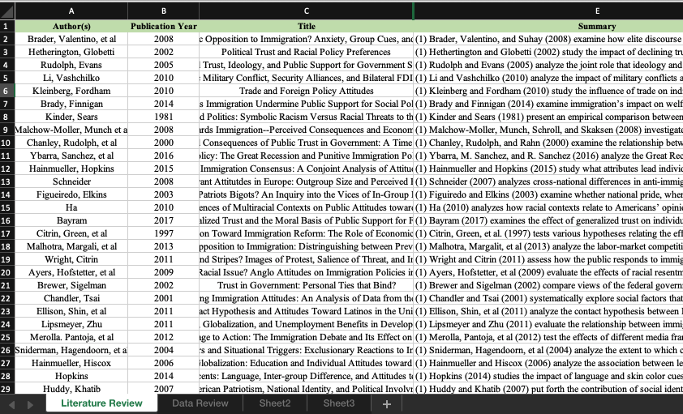

class: split-40 nopadding
background-image: url( bkgs/biru.jpg )

.column_t2.center[.vmiddle.pushfront[
.figplaint-maxh350.opacity7[

### University of the West Indies Cavehill Campus
 

 
_Guest Lecture_
<!--  -->
]
]]
.column_t2.shadelightdark.add-left-border.pushfront[.vmiddle.nopadding[
.boxtitle4[
### .fonth5[Reviewing the Literature]
## .fsize105[.or1[SOCI 2006: Qualitative Research Methods]]

### 
### 
#### Joshua Scriven, MSc. | .blue[jscriven@fsu.edu] | Date: 03.10.2019
#### 
]
]]

???
Hello and welcome

---
class: column_t1 middle

.fonth4[
.tabtype1.fullwidth[
| Outline   |
|:-------------:|
|Goals of a Literature Review|
|Where to Find Research Literature|
|How to Conduct a Systematic Literature Review|
|How to Evaluate Research Articles|
|Note Taking, Organization, & Writing|
|Discussion: Using the Internet for Social Research|

]]

---

class: split-40 nopadding
background-image: url( bkgs/seurat1.jpg )

.column_t2.center[.vmiddle[
.figplaint-maxh350.opacity9[

]
]]
.column_t2[.vmiddle.nopadding[
.shadelightdark[.boxtitle1[
### 
# .fsize75[Goals of a Literature Review]

### 
### 
#### 
#### 
]]
]]

---
class: column_t1 middle center

.fonth2[.yellow[Goal **1**]]  .fonth4[To demonstrate a familiarity with a body of knowledge and establish credibility.]  .fonth5[A review tells a reader that the researcher knows the research in an area and knows the major issues. A good review increases a reader’s confidence in the researcher’s professional competence, ability, and background.]

???

- I know about Nuclear weapons:
- The first fission bombs were dropped by the Allied forces in WWII in the Pacific conflict with Japan
- I know that many people at the time were convinced of the necessity of the bombs
- I know that many people today are opposed to the use of such weapons of mass and indiscriminate destruction

---
class: column_t1 middle center

.fonth2[.yellow[Goal **2**]]  .fonth4[To show the path of prior research and how a current project is linked to it.]  .fonth5[A review outlines the direction of research on a question and shows the development of knowledge. A good review places a research project in a context and demonstrates its relevance by making connections to a body of knowledge.]

???

Individual's belief that the government performs its job well.
- What terms would you use?
- Political trust
- Confidence in government
- Trust in government

What could you do to measure?

---
class: column_t1 middle center

.fonth2[.yellow[Goal **3**]]  .fonth4[To integrate and summarize what is known in an area. A review pulls together and synthesizes different results.]  .fonth5[A good review points out areas in which prior studies agree, disagree, and major questions remain. It collects what is known up to a point in time and indicates the direction for future research.]

???

- What is the current extent of human knowledge in this topic?
- Which theories still make sense in light of new knowledge, and which deserve an update?
- What new questions could we derive from our current understanding of the the topic, in light of previous attempt at explanation?

---
class: column_t1 middle center

.fonth2[.yellow[Goal **4**]]  .fonth4[To learn from others and stimulate new ideas.]  .fonth5[A review tells what others have found so that a researcher can benefit from the efforts of others. A good review identifies blind alleys and suggests hypotheses for replication. It divulges procedures, techniques, and research designs worth copying so that a researcher can better focus hypotheses and gain new insights.]

???

- Example RQ : Does a fear of nuclear weapons have an impact on the likelihood of war?
- What were the methods applied to investigating the topic?
- Are there any nuances that we could use to refine the question? 

---
class: split-40 nopadding
background-image: url( bkgs/seurat1.jpg )

.column_t2.center[.vmiddle[
.figplaint-maxh350.opacity8[

]
]]
.column_t2[.vmiddle.nopadding[
.shadelightdark[.boxtitle1[
### 
# .fsize75[Where to Find Research Literature]

### 
### 
#### 
#### 
]]
]]

---

class: split-40 nopadding 

.column_t1[.vmiddle.pushfront.right[
#.fsize65.or1[Scholarly Journals] 
#.fsize65.bluelight[Dissertations] 
#.fsize65.bluelight[Other] 
]]
.column_t2[.vmiddle.pushfront.defaultalign[

.fonth4[
- Primary source to use for a literature review
- Where most researchers disseminate new findings
- Scholarly journals vary by prestige and acceptance rates
- Acceptance rates declining due to increasing studies and rigor(?)
- .red[$25 per article] without a subscription
]

]]

---

class: split-40 nopadding 

.column_t1[.vmiddle.pushfront.right[
#.fsize65.or1[Scholarly Journals] 
#.fsize65.bluelight[Dissertations] 
#.fsize65.bluelight[Other] 
]]
.column_t2[.vmiddle.pushfront.defaultalign[

.fonth4[
Examples:
- JSTOR
- Project MUSE
- Anthrosource
- Proquest
- EBSCO HOST
]

]]

---

class: split-40 nopadding 

.column_t1[.vmiddle.pushfront.right[
#.fsize65.bluelight[Scholarly Journals] 
#.fsize65.or1[Dissertations] 
#.fsize65.bluelight[Other] 
]]
.column_t2[.vmiddle.pushfront.defaultalign[

.fonth4[
- Original research completed as requirement for Ph.D. 
- Often later published as book or article(s).
- Kept at library of degree-granting University 
]

]]

---

class: split-40 nopadding 

.column_t1[.vmiddle.pushfront.right[
#.fsize65.bluelight[Scholarly Journals] 
#.fsize65.bluelight[Dissertations] 
#.fsize65.or1[Other] 
]]
.column_t2[.vmiddle.pushfront.defaultalign[

.fonth4[
- Scholarly Books
- Government Documents
- Policy Reports
- Presented Papers
- Periodicals
]

]]

---
class: column_t1 middle center

.fonth2[.yellow[Types of Publications]]  

<!-- "TABLE 1" in _ Neuman, Ch 5_ -->

---
class: split-40 nopadding
background-image: url( bkgs/seurat1.jpg )

.column_t2.center[.vmiddle[
.figplaint-maxh350.opacity9[

]
]]
.column_t2[.vmiddle.nopadding[
.shadelightdark[.boxtitle1[
### 
# .fsize75[How to Conduct a Systematic Literature Review]

### 
### 
#### 
#### 
]]
]]

---
class: column_t1 middle center

#.fsize75[Research Question]

# .fsize105[.or1[**Define**] | .bluelight[Refine]]

You need to begin a literature review with a clearly defined,well-focused research question and a plan. A good review topic should be in the form of a research question. 
<!-- For example, “divorce” or “crime” is much too broad. A more appropriate review topic might be “What contributes to the stability of families with stepchildren?” or “Does economic inequality produce crime rates across nations?”
 -->Often, a researcher will not finalize a specific research question for a study until he or she has reviewed the literature. 
The review usually helps to focus on the research question.

---
class: split-40 nopadding bkgpos_00
background-image: url( images/search_results.png )

.column_t2.center[.vmiddle[

]]
.column_t2[.vmiddle.nopadding[
.shadelightdark[.boxtitle1.noborder[
### 
# .yellow[Design a Search]

### 
### 
#### 
#### 
]]
]]

???

Bring up operationalization

After choosing a focused research question for the review, the next step is to plan a search strategy. You must decide on the type of review, its extensiveness, and the types of materials to include. The key is to be careful, systematic, and organized. Set parameters on your search: how much time you will devote to it, how far back in time you will look, the minimum number of research

135 HOW TO REVIEW THE LITERATURE AND CONDUCT ETHICAL STUDIES

reports you will examine, how many libraries you will visit, and so forth.

Also decide how to record the bibliographic citation for each reference and how to take notes (e.g., in a notebook, on 3"  5" cards, in a computer file). You should begin a file folder or computer file in which you can place possible sources and ideas for new sources. As your review proceeds, you should more narrowly focus on a specific research question or issue.

---
class: split-40 nopadding bkgpos_00
background-image: url( images/annual_reviews.png )

.column_t2.center[.vmiddle[

]]
.column_t2[.vmiddle.nopadding[
.shadelightdark[.boxtitle1.noborder[
### 
# .yellow[Locating Research Reports]

### 
### 
#### 
#### 
]]
]]

---

class: split-40 nopadding 
<!-- background-image: url( images/review.png )
background-size: 50px 100px; -->

.column_t2.center[.vmiddle[

]]
.column_t2[.vmiddle.nopadding[
.shadelightdark[.boxtitle1.noborder[
### 
# .yellow[Locating Research Reports]

### 
### 
#### 
#### 
]]
]]

---
class: column_t1 middle center nopadding

 

Google Scholar \*
Google Books / Amazon - Books \*
General Search Engines \*
Subject-Matter Expert Podcasts \*
RSS (Really Simple Syndication) Feeds

.shadelightdark.bottom_abs[.boxtitle1.noborder.center[
### .yellow[Locating Research Reports] 
]]

---
class: split-40 nopadding
background-image: url( bkgs/seurat1.jpg )

.column_t2.center[.vmiddle[
.figplaint-maxh350.opacity9[

]
]]
.column_t2[.vmiddle.nopadding[
.shadelightdark[.boxtitle1[
### 
# .fsize75[How to Evaluate Research Articles]

### 
### 
#### 
#### 
]]
]]

---
class: column_t1 middle center

.fonth2[.yellow[**1** Examine the title]]  .fonth4[It describes the topic, may mention one or two major variables, and tells about the setting or participants.]  .fonth5[Are these variables my dependent or independent variables? Does the topic relate tangentially to what I am writing about? Should the variables mentioned interact in a parallel way to my expectations about my own independent and dependent variables?]

---
class: column_t1 middle center

.fonth2[.yellow[**2** Read the abstract]]  .fonth4[Summarizes critical information about a study. It gives the study’s purpose, identifies methods used, and highlights major findings.]  .fonth5[.]

---
class: column_t1 middle center

.fonth2[.yellow[**3** Skim the article]]  .fonth4[Before reading the entire article, you may want to skim the first several paragraphs at the beginning and quickly read the conclusion.]  .fonth5[**The introduction**:
- introduces a broad topic and highlights the study's specific research question
- highlights the research question’s significance 
- outlines a theoretical framework and define major concepts.]

---
class: column_t1 middle center

.fonth2[.red[**4** Read the Article]]  .fonth4[Sometimes researchers make a terrible mistake in not reading the entire article.]  .fonth5[
- The methodology and analysis sections explain operationalization and testing techniques.
- The results and discussion sections explain the ways in which the tests of the research question's implications were in support of the research question or not.
- .red[**If you refer to a paper that is not talking about the things you think, your credibility and competence as a researcher is greatly diminished.**]]

---
class: split-40 nopadding
background-image: url( bkgs/seurat1.jpg )

.column_t2.center[.vmiddle[
.figplaint-maxh350.opacity9[

]
]]
.column_t2[.vmiddle.nopadding[
.shadelightdark[.boxtitle1[
### 
# .fsize75[Note Taking, Organization, & Writing]

### 
### 
#### 
#### 
]]
]]

---
class: column_t1 middle center

.fonth2[.yellow[Summary Example]]  

???

What to Record
Organize Notes
Planning and Writing the Review

---
class: column_t1 middle center

.fonth2[.yellow[Summarize & Track Example]]  

---
class: column_t1 middle center

.fonth2[.yellow[Helpful Names for Computer Files]]  

"MacCoun2005a__Voice, control, and belonging- The double-edged sword of procedura.pdf"

---
class: column_t1 middle center

.fonth2[.yellow[Reference Management]]  

---
class: column_t1 middle center

.fonth2[.yellow[Reference Styles & Citations]]  

---
class: column_t1 middle center

.fonth2[.yellow[Reference Styles & Citations]]  

---
class: split-40 nopadding
background-image: url( bkgs/seurat1.jpg )

.column_t2.center[.vmiddle[
.figplaint-maxh350.opacity9[

]
]]
.column_t2[.vmiddle.nopadding[
.shadelightdark[.boxtitle1[
### 
# .fsize75[Discussion: Using the Internet for Social Research]

### 
### 
#### 
#### 
]]
]]

???

The Advantages.

1. The Internet is easy, fast, and cheap. It is widely accessible, and can be used from many locations. This nearly free resource allows people to find source material from almost anywhere: local public libraries,homes,labs or classrooms,coffee shops,

or anywhere a computer can connect to the Internet. It operates 24 hours a day, 7 days a week. With minimal training, most people can quickly perform searches and get information that a few years ago would have required them to take a trip to large research libraries. Searching a vast quantity of information electronically is easier and faster than a manual search. The Internet greatly expands the amount and variety of source material. In addition, once the information is located, a researcher can often store it electronically or print it at a local site.

2. The Internet has “links” that provide additional ways to find and connect to other sources of information. Web sites, home pages, and other Internet resource pages have links that can call up information from related sites or sources simply by clicking on the link indicator (usually a button or a highlighted word or phrase). This connects the user to more information and provides access to cross-referenced material. Links embed one source within a network of related sources.

3. The Internet greatly speeds the flow of information around the globe and has a “democratizing” effect. It provides rapid transmission of information (e.g., text, news, data, and photos) across long distances and national borders. Accessing some reports 10 years ago required waiting a week or month and spending some money; today you obtain them within seconds at no cost. Almost no restrictions limit who puts material on the Internet or what appears on it. This means that people who had difficulty publishing or disseminating materials can now do so with ease. Because of its openness, the Internet reinforces the norm of universalism.

4. The Internet provides access to a vast range of information sources, some in formats that are quite dynamic and interesting. You can access a report in black-and-white text, as in traditional academic journals and sources, or with bright colors, graphics, moving images, photos, and even audio and video clips. Authors and other creators of information can be creative in their presentations.

The Disadvantages.

1. There is no quality control over what can be put on the Internet. Unlike standard academic

---
class: split-40 nopadding
background-image: url( bkgs/biru.jpg )

.column_t2.center[.vmiddle.pushfront[
.figplaint-maxh350.opacity7[

### University of the West Indies Cavehill Campus
 

 
_Guest Lecture_
<!--  -->
]
]]
.column_t2.shadelightdark.add-left-border.pushfront[.vmiddle.nopadding[
.boxtitle4[
### .fonth5[End of Slides]
## .fsize105[.or1[Reviewing the Literature]]

### 
### 
#### Joshua Scriven, MSc. | .blue[jscriven@fsu.edu] | Date: 03.10.2019
#### 
]
]]
